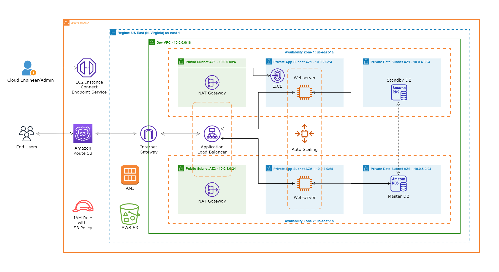

# E-Commerce Web App Deployment on AWS

## Project Overview

This project involves the deployment of a dynamic e-commerce web application on AWS. The application is hosted on EC2 instances and utilizes various AWS services for high availability, fault tolerance, and scalability.

## Architecture

- **VPC Configuration**: Utilizes public and private subnets across two availability zones for improved reliability and security.
- **Internet Gateway**: Facilitates communication between the instances in the VPC and the Internet.
- **High Availability Setup**: Leverages two Availability Zones.
- **Security**: Employs Security Groups as a firewall.
- **Public Subnet Resources**: Includes a NAT Gateway, a Bastion Host, and an Application Load Balancer.
- **Private Subnet Resources**: Hosts web servers and database servers for enhanced security.
- **Database**: Utilizes MySQL RDS for database management.
- **Auto Scaling & Load Balancing**: Employs an Auto Scaling Group and an Application Load Balancer for traffic distribution and scalability.
- **Domain Name and DNS**: Managed using AWS Route 53.
- **Storage**: Uses AWS S3 for storing web files.
- **Permissions**: Implements IAM Roles for EC2 instances to access S3.
- **AMI Creation**: Involves creating an AMI from the configured EC2 instance.

## Deployment Scripts
Install software necessary for the application to run:

```bash
# This command updates all the packages on the server to their latest versions
sudo yum update -y

# This series of commands installs the Apache web server, enables it to start on boot, and then starts the server immediately
sudo yum install -y httpd
sudo systemctl enable httpd 
sudo systemctl start httpd

## This command installs PHP 8 along with several necessary extensions for the application to run
sudo dnf install -y php php-cli php-fpm php-mysqlnd php-bcmath php-ctype php-fileinfo php-json php-mbstring php-openssl php-pdo php-gd php-tokenizer php-xml

## These commands Installs MySQL version 8
# Install the MySQL Community repository
sudo wget https://dev.mysql.com/get/mysql80-community-release-el9-1.noarch.rpm 
#
# Install the MySQL server
sudo dnf install -y mysql80-community-release-el9-1.noarch.rpm 
dnf repolist enabled | grep "mysql.*-community.*"
sudo dnf install -y mysql-community-server 
#
# Start and enable the MySQL server
sudo systemctl start mysqld
sudo systemctl enable mysqld

# Install the cURL and PHP cURL packages
sudo yum install -y curl libcurl libcurl-devel php-curl --allowerasing

# Restart the PHP-FPM service to apply the changes
sudo service php-fpm restart

# Update the settings, memory_limit to 128M and max_execution_time to 300 in the php.ini file
sudo sed -i 's/^\s*;\?\s*memory_limit =.*/memory_limit = 128M/' /etc/php.ini
sudo sed -i 's/^\s*;\?\s*max_execution_time =.*/max_execution_time = 300/' /etc/php.ini

# This command enables the 'mod_rewrite' module in Apache on an EC2 Linux instance. It allows the use of .htaccess files for URL rewriting and other directives in the '/var/www/html' directory
sudo sed -i '/<Directory "\/var\/www\/html">/,/<\/Directory>/ s/AllowOverride None/AllowOverride All/' /etc/httpd/conf/httpd.conf

# Check PHP version
php -v

# List installed PHP modules
php -m

# Check MySQL version
mysql -V

# Check MySQL service status
systemctl status mysqld

# Check memory_limit setting
grep -i "memory_limit" /etc/php.ini

# Check max_execution_time setting
grep "max_execution_time" /etc/php.ini
```

Install and configure the application:

```bash
# This command downloads the contents of the specified S3 bucket to the '/var/www/html' directory on the EC2 instance
sudo aws s3 sync s3://aosnote-nest-app-code /var/www/html

# This command changes the current working directory to '/var/www/html', which is the standard directory for hosting web pages on a Unix-based server
cd /var/www/html

# This command is used to extract the contents of the application code zip file that was previously downloaded from the S3 bucket
sudo unzip nest-app.zip

# This command recursively copies all files, including hidden ones, from the 'nest-app' directory to the '/var/www/html/'.
sudo cp -R nest-app/. /var/www/html/

# This command permanently deletes the 'nest-app' directory and the 'nest-app.zip' file.
sudo rm -rf nest-app nest-app.zip

# This command set permissions 777 for the '/var/www/html' directory and the 'storage/' directory
sudo chmod -R 777 /var/www/html
sudo chmod -R 777 storage/

# This command use sed to search the .env file for a line that starts with APP_URL= and replace everything after the = character with the app's domain name
sudo sed -i "/^APP_URL=/ s/=.*$/=https:\/\/www.aosnotes77.com\//" .env

# This command use sed to search the .env file for a line that starts with DB_HOST= and replace everything after the = character with the rds endpoint
sudo sed -i "/^DB_HOST=/ s/=.*$/=app-db.cu2idoemakwo.us-east-1.rds.amazonaws.com/" .env

# This command use sed to search the .env file for a line that starts with DB_DATABASE= and replace everything after the = character with the rds database name
sudo sed -i "/^DB_DATABASE=/ s/=.*$/=applicationdb/" .env

# This command use sed to search the .env file for a line that starts with DB_USERNAME= and replace everything after the = character with the rds database username
sudo sed -i "/^DB_USERNAME=/ s/=.*$/=azeezs/" .env

# This command use sed to search the .env file for a line that starts with DB_PASSWORD= and replace everything after the = character with the rds database password
sudo sed -i "/^DB_PASSWORD=/ s/=.*$/=azeezs123/" .env

# This command will restart the Apache server
sudo service httpd restart
```

Migrate data into RDS with Flyway:

```bash
# Download and extract Flyway
sudo wget -qO- https://repo1.maven.org/maven2/org/flywaydb/flyway-commandline/9.20.0/flyway-commandline-9.20.0-linux-x64.tar.gz | tar -xvz

# Create a symbolic link to make Flyway accessible globally
sudo ln -s $(pwd)/flyway-9.20.0/flyway /usr/local/bin

# Create the SQL directory for migrations
sudo mkdir sql

# Download the migration SQL script from AWS S3
aws s3 cp s3://aosnote-nest-sql-files/V1__nest.sql sql/

# Run Flyway migration
sudo flyway -url=jdbc:mysql://app-db.cu2idoemakwo.us-east-1.rds.amazonaws.com:3306/applicationdb \
  -user=azeezs \
  -password=azeezs123 \
  -locations=filesystem:sql \
  migrate
```

### Software Installation Script

This script installs necessary software like Apache, PHP, MySQL, and additional utilities on the EC2 instance. It updates package repositories, installs server components, sets up PHP and MySQL, and configures server settings.

#### Key Commands:
- Update packages: `sudo yum update -y`
- Install Apache, PHP, MySQL: `sudo yum install httpd`, `sudo dnf install -y php ...`, `sudo dnf install -y mysql-community-server`
- Configure PHP and Apache settings.

### Application Installation and Configuration

This script deals with deploying the web application from an S3 bucket, configuring environment settings, setting permissions, and performing database migrations using Flyway.

#### Key Commands:
- Sync S3 bucket: `sudo aws s3 sync s3://[bucket-name] /var/www/html`
- Set permissions: `sudo chmod -R 777 /var/www/html`
- Configure application settings: `sudo sed -i ...` for various `.env` configurations.
- Flyway migration commands.

## Usage

- **Deployment**: Follow the scripts in order to set up the EC2 instances with the necessary software and application code.
- **Configuration**: Replace placeholders in the scripts with your specific AWS resource details and application configurations.
- **Migration**: Ensure the database is correctly set up before running Flyway migrations.

## Contributing

Contributions to this project are welcome. Please follow the standard fork-and-pull request workflow on GitHub.

## License

[Specify the license under which this project is released]
